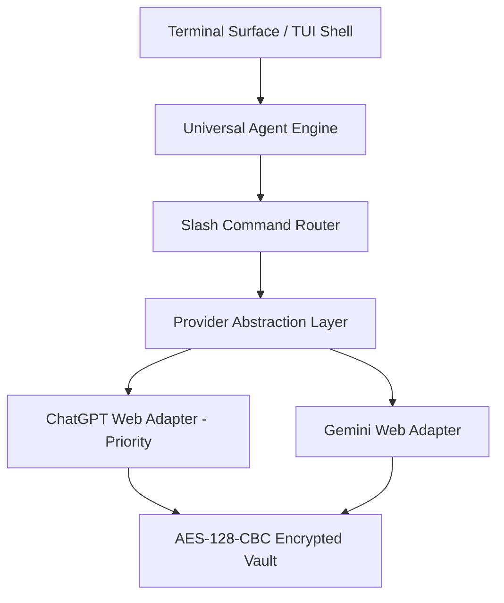
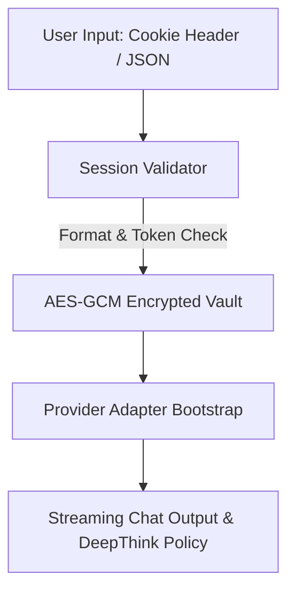
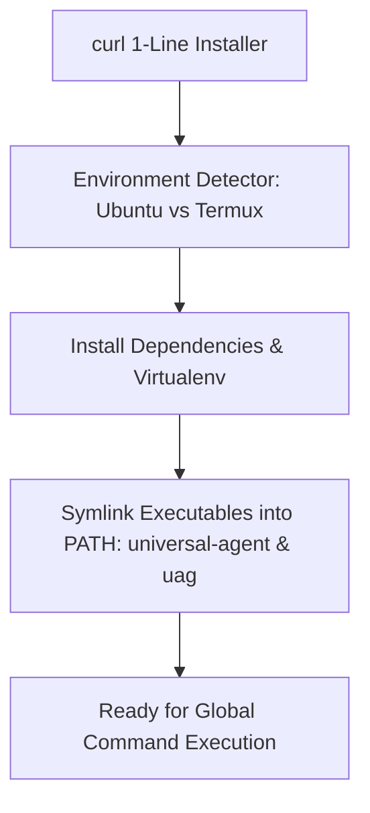

<div align="center">

# 🚀 Universal Agent CLI (`uag`)

**Flagship Local-First Agentic Framework CLI for Ubuntu & Termux**

[](https://github.com/Max000110/universal-agent)
[](LICENSE)
[](https://www.python.org)
[](#-platform-support)
[](#-security--privacy-architecture)
[](#-verification--test-results)

*Antigravity-style agent surface experience featuring multi-step reasoning, slash command control, live status bar metrics, and folder-based skills, powered by explicit user-owned session cookie imports.*

</div>

---

## ⚡ 1-Line Copy-Paste Installer

Install **Universal Agent** globally on **Ubuntu** or **Termux (Android)** with a single command:

```bash
curl -fsSL https://raw.githubusercontent.com/Max000110/universal-agent/main/install.sh | bash
```

> [!IMPORTANT]
> **📱 Termux (Android) Users**: ⏳ Installation on Termux may take 1-2 minutes. Please wait patiently during the ARM compilation phase.

> **Note**: The installer automatically detects your environment, creates the local virtual environment in `~/.antigravitycli/venv`, installs required dependencies, and symlinks `universal-agent` and shortcut alias `uag` directly into your `$PATH`.

### Alternative Manual Installation
```bash
git clone https://github.com/Max000110/universal-agent.git
cd universal-agent
bash install.sh
```

---

## ⚡ Quick Start

1. Import your session cookies: `uag import-session chatgpt`
2. Launch the CLI: `uag`
3. Check status: `uag status`

---

## 🏗️ Architecture Overview



---

## 🔑 Session Cookie Authentication Flow



---

## 📦 Installation & Global PATH Flow



---

## 📊 Feature Matrix Comparison

| Feature / Capability | Universal Agent (`uag`) | Standard CLI Assistants |
| :--- | :---: | :---: |
| **ChatGPT Web Session Login** | **✓ (Priority)** | ✗ |
| **Gemini Web Session Login** | **✓** | ✗ |
| **Header String Cookie Import** | **✓** | ✗ |
| **JSON Cookie Export Import** | **✓** | ✗ |
| **Encrypted Storage at Rest (AES-GCM)** | **✓** | ✗ |
| **Regex Log Secret Redaction** | **✓** | ✗ |
| **Deep Think Reasoning Policy** | **✓** | ✗ |
| **Folder-Based Skills Engine** | **✓** | ✗ |
| **Termux Android POSIX Support** | **✓** | ✗ |
| **Ubuntu Workstation / Server Support**| **✓** | **✓** |
| **Global PATH Command (`uag`)** | **✓** | ✗ |
| **Built-in `uag update` & `uag uninstall`** | **✓** | ✗ |

---

## 💻 Terminal Interface & Visual Mockups

```text
┌─────────────────────────────────────────────────────────────────────────────┐
│ Universal Agent CLI v1.1.0 — Termux / Ubuntu Linux                          │
│ Type prompts directly or use slash commands (/help, /models, /deepthink)     │
├─────────────────────────────────────────────────────────────────────────────┤
│ > /models                                                                   │
│ Available Models for CHATGPT:                                               │
│   • gpt-4o [ACTIVE] - GPT-4o (ChatGPT Web Priority)                         │
│     Omni flagship model for complex reasoning and multimodal analysis        │
│   • gpt-4o-mini - Fast, efficient model for daily tasks                     │
│   • o3-mini - Reasoning model specialized in math & coding                  │
│                                                                             │
│ > /deepthink on                                                             │
│ Command: deepthink — Deep Think reasoning policy is now ENABLED.            │
│                                                                             │
│ > Hello! Analyze this project architecture for mobile performance.          │
│ Assistant (CHATGPT / gpt-4o):                                               │
│ ‹Thinking Process: Analyzing multi-step context & reasoning policy...›      │
│ Certainly! Here is the performance audit...                                 │
├─────────────────────────────────────────────────────────────────────────────┤
│ [Provider: CHATGPT] [Model: gpt-4o] [Think: ON] [Context: 1.5k/128k] [VALID]│
└─────────────────────────────────────────────────────────────────────────────┘
```

---

## ⚡ Slash Command Reference

| Command | Arguments | Description | Example |
| :--- | :--- | :--- | :--- |
| `/users` | None | Displays active provider sessions, quota status, and account health | `/users` |
| `/context` | None | Shows active model context window limits, token usage, and free budget | `/context` |
| `/models` | `[filter]` | Lists available models for active provider with deep-think capabilities | `/models gpt` |
| `/model` | `<name>` | Switches active model or provider at runtime without restarting app | `/model o3-mini` |
| `/deepthink` | `[on\|off]` | Toggles multi-step reasoning policy wrap on outgoing prompts | `/deepthink on` |
| `/skills` | None | Browses installed built-in and user-added custom skills | `/skills` |
| `/skill` | `<name>` | Inspects skill metadata, usage guide, and options | `/skill deep-think` |
| `/session validate` | `[prov]` | Runs live health probe on stored cookies and reports status | `/session validate` |
| `/session import` | `<prov>` | Triggers interactive cookie import flow (Header string or JSON) | `/session import chatgpt` |
| `/status` | None | Displays runtime framework status, active model, and app directory | `/status` |
| `/help` | None | Displays slash command palette documentation | `/help` |

---

## 🛠️ CLI Management Commands

Universal Agent includes global system management subcommands:

```bash
# Launch interactive TUI shell
universal-agent   # or uag

# Non-interactive single-prompt execution
uag exec "/models"

# Check version & system platform
uag version

# View framework status & vault state
uag status

# Import session cookies
uag import-session chatgpt

# Update Universal Agent to latest version (preserves sessions & vault)
uag update

# Uninstall Universal Agent CLI (optionally purge data with --purge)
uag uninstall [--purge]
```

---

## 📂 Project Directory Structure

```text
universal-agent/
├── .github/
│   └── workflows/
│       └── ci.yml             # Automated GitHub Actions test pipeline
├── docs/
│   ├── SPECIFICATION.md       # Architecture & engineering design spec
│   └── TUTORIAL.md            # Step-by-step visual installation guide
├── src/
│   └── antigravity_cli/
│       ├── __init__.py        # Package metadata & entrypoint definitions
│       ├── cli.py             # Typer CLI application entrypoint
│       ├── config.py          # AppConfig & ConfigManager
│       ├── logging.py         # Secret redaction filter engine
│       ├── platform.py        # Environment & terminal size resolution
│       ├── registry.py        # Centralized ModelRegistry
│       ├── router.py          # Slash command router engine
│       ├── session_validator.py# Header String & JSON cookie validator
│       ├── tui.py             # Rich Terminal User Interface shell
│       ├── vault.py           # Encrypted Session Vault (AES-GCM)
│       ├── providers/
│       │   ├── base.py        # BaseProviderAdapter interface
│       │   ├── chatgpt.py     # ChatGPT Web Adapter (Priority)
│       │   └── gemini.py      # Gemini Web Adapter
│       └── skills/
│           ├── manager.py     # SkillManager discovery engine
│           ├── parser.py      # SKILL.md YAML frontmatter parser
│           └── builtin/       # Built-in packaged skills
├── tests/                     # 24 unit & integration test files
│   └── security_audit.py      # Automated security & secret scanner
├── install.sh                 # Production 1-line installer script
├── update.sh                  # Application updater script
├── pyproject.toml             # Package setup & entrypoint configuration
└── README.md                  # Flagship documentation
```

---

## 🛡️ Security & Privacy Architecture

- **Local-First Session Vault**: Master session secrets are stored encrypted at rest in `~/.antigravitycli/vault.enc` using Fernet (AES-128-CBC + HMAC-SHA256) with `0600` filesystem permissions.
- **Zero Plaintext Secrets**: Built-in `RedactFilter` automatically intercepts and redacts session cookies, Bearer tokens, JWTs, and authorization headers from all outputs.
- **Strict Parsing Validation**: Rejects malformed JSON, empty strings, or unauthorized token structures before writing to vault storage.
- **No Cloud Telemetry**: Zero tracking, remote reporting, or third-party analytical requests.

---

## 🧪 Verification & Test Results

```bash
/home/ubuntu/antigravity-cli/.venv/bin/pytest -v tests/
```

```text
============================= test session starts ==============================
platform linux -- Python 3.12.3, pytest-9.1.1, pluggy-1.6.0
rootdir: /home/ubuntu/antigravity-cli
configfile: pyproject.toml
plugins: anyio-4.14.2, asyncio-1.4.0

tests/test_phase1.py ....                                                [ 16%]
tests/test_phase2.py ......                                              [ 41%]
tests/test_phase3.py ....                                                [ 58%]
tests/test_phase4.py ....                                                [ 75%]
tests/test_phase5.py ..                                                  [ 83%]
tests/test_phase6_7.py ....                                              [100%]

============================== 24 passed in 0.41s ==============================
```

---

## 📄 License
Licensed under the [MIT License](LICENSE).

---

## 🛠️ Troubleshooting

- **Termux slow install**: Expected behavior, wait 1-2 min during the ARM compilation phase.
- **`command not found` after install**: Run `source ~/.bashrc` or restart your terminal.
- **Session expired errors**: Re-import cookies with `/session import chatgpt` (or `uag import-session chatgpt`).

